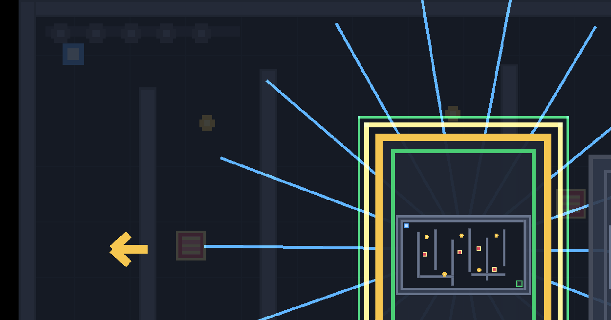
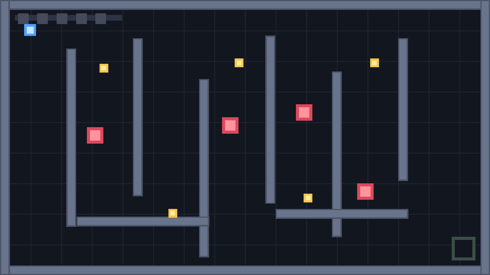

# 開発日誌

開発の進み具合を、日付ごとのライナーノーツとして残す。

## 2026年6月14日

ステージデータを C# 直書きから JSON へ移し、最小マップエディターで配置を調整できるところまで進めた。

やったこと:

- `Stages/stage-001.json` から `Stages/stage-007.json` までを作成し、全ステージのマップデータを JSON 化した。
- `StageData.cs` と `StageLoader.cs` を追加し、ゲーム本体が `Stages/stage-*.json` を読み込んでステージを作るようにした。
- `StageDefinitions.cs` は巨大なステージ直書きをやめ、`StageLoader.LoadStages()` を呼ぶだけの入口にした。
- `SkylarkBimbleStreet.csproj` で `Stages/*.json` をビルド出力へコピーするようにした。
- Debug / Release の出力先に 7 個の JSON がコピーされることを確認した。
- 実プレイで Stage 1 から Stage 7 まで全ステージをクリアできることを確認した。
- `SkylarkBimbleStreet.Editor` を別プロジェクトとして追加した。
- エディターは MonoGame DesktopGL ベースにし、ゲーム本体と同じ `1920 x 1080` 座標系でステージを表示するようにした。
- エディターで壁、収集物、出口、バス停、病院、障害物、障害物の移動範囲、プレイヤー開始位置を表示するようにした。
- エディターで左クリック選択、ドラッグ移動、左右キーでのステージ切り替え、`S` 保存、`R` 再読み込みができるようにした。
- エディターを使って、ゲーム内オブジェクトの位置を実際に調整できることを確認した。
- `SkylarkBimbleStreet.Editor/EditorDocs` にエディター用ドキュメントを追加した。
- `EditorDocs/利用者向け/マップエディター操作説明書.md` に、起動方法、画面の見方、基本操作、注意点を書いた。
- `EditorDocs/開発/実装メモ.md` に、現在の実装範囲、制限、次に足す候補を書いた。
- `EditorDocs/続きはここから.md` に、エディター作業の再開用メモを残した。
- `Docs/開発/マップエディター実装計画.md` と `Docs/続きはここから.md` を、JSON 化完了とエディター最小版追加後の状態へ更新した。

確認:

- `dotnet build .\SkylarkBimbleStreet.sln -c Debug --no-restore` は成功。警告 0、エラー 0。
- `dotnet build .\SkylarkBimbleStreet.sln -c Release --no-restore` は成功。警告 0、エラー 0。
- `dotnet build .\SkylarkBimbleStreet.slnx -c Debug --no-restore` は成功。警告 0、エラー 0。
- エディターの短時間起動確認で、JSON 読み込みで落ちないことを確認した。
- ユーザー実プレイで、JSON 化後の全ステージクリアを確認した。
- ユーザー操作で、マップエディターからゲーム内オブジェクト位置を調整できることを確認した。

次にやる候補:

- エディター保存時にバックアップを作る。
- グリッドスナップを追加する。
- 矩形の追加、削除、サイズ変更を追加する。
- 障害物の移動範囲 `min` / `max` をエディターで編集できるようにする。
- 符牒の破片と宝石を JSON 上で分けるか検討する。
## 2026年6月13日

ステージセレクトのクリア済みチェック印の保持を直した。

やったこと:

- クリア済みステージ印を、ラン統計やリトライのリセット対象から外した。
- アプリ起動中にクリアした複数ステージのチェック印が、ポーズからステージセレクトへ戻っても残るようにした。
- ステージセレクトカードに、実ステージデータから作るミニマップ風プレビューを追加した。
- ステージカード下部に、宝石数、障害物数、クリア状態を示す小アイコン列を追加した。
- ステージセレクトで左右移動したとき、選択カードが中央へ戻るようにカード列をスクロールさせる形にした。
- 選択中カードの外枠脈動を固定枠寄りに戻し、カード列スクロールと重なってブレて見えないようにした。
- ステージセレクトのカード拡大は、スクロールが終わって中央へ戻ったあとだけ行うようにした。
- ステージセレクトのカード拡大に補間を入れ、中央へ戻ったあとに滑らかに大きくなるようにした。
- ステージセレクトの左右移動を非ループにし、端では矢印を暗く表示するようにした。
- ウィンドウを閉じたあとプロセス終了まで長く感じる件を調査した。
- アプリ本体の終了処理は軽く、直接起動ではウィンドウクローズからプロセス終了まで約 160ms、`dotnet run --no-build` 経由でも約 201ms だった。
- ただし Visual Studio デバッグ/Hot Reload 由来のモジュールが入った状態では、終了時に `SkylarkBimbleStreet.exe` が `ntdll.dll` / `0xc0000008` で `APPCRASH` として Windows Error Reporting に記録されていた。
- `Report.wer` では `Microsoft.VisualStudio.Debugger.Runtime.*`、`Microsoft.Extensions.DotNetDeltaApplier.dll`、`SDL2.dll`、`OPENGL32.DLL`、NVIDIA OpenGL ドライバーがロードされていた。原因はアプリの通常終了処理ではなく、Visual Studio のデバッグ/Hot Reload 注入と MonoGame DesktopGL の SDL/OpenGL 終了処理の組み合わせが濃厚。
- Visual Studio 由来の環境を引き継がない `-UseNewEnvironment` 起動では終了約 160ms、イベントログの新規エラー 0件だった。
- 対策候補は、Visual Studio では「デバッグなしで開始」を使う、または Hot Reload を切ること。
- 実際に Hot Reload のチェックを外し、Release モードにしたうえで「デバッグなしで開始」したところ、ウィンドウを閉じたあとすぐ終了した。しばらくこの運用で様子を見る。
- 起動前の遅さ対策として、`SkylarkBimbleStreet.csproj` から重複していた独自 `RestoreDotnetTools` ターゲットを削除し、MonoGame 側の `AutoRestoreMGCBTool` も `false` にした。MGCB ツールは初回や更新時に手動で `dotnet tool restore` する運用にする。
確認:

- `dotnet build .\SkylarkBimbleStreet.slnx` は成功。警告 0、エラー 0。

## 2026年6月12日

新しいステージ作成方針に沿って、5面を追加した。

この画像は Stage 5 追加後の、開発中のステージセレクト画面イメージです。

やったこと:

- Stage 5 を追加し、ステージセレクトと通しプレイで選べるステージ数を増やした。
- スタートからゴールまでの主導線を先に確保し、その導線上に宝石を置く配置にした。
- 分割した壁で折り返し通路を作り、宝石をすべて取得したあとに出口へ向かえる構成にした。
- ステージ数が増えても右上のステージ表示が画面内に収まるようにした。
- Stage 5 の右側で縦壁と横壁が接続して通路を塞いでいたため、右下の縦壁とジグザグ横壁を短くして隙間を作った。
- プレイヤーサイズ込みの簡易到達判定で、Stage 5 の全宝石と出口に到達できることを確認した。
- 実プレイで Stage 5 をクリアできることを確認した。
- ポーズメニューに色パレット切り替えカードを追加した。
- 通常、色覚配慮、高コントラスト、モノクロ確認用の4パレットを追加した。
- パレット切り替えはゲーム進行に関わるオブジェクトとHUDを対象にし、クリア演出の色はそのままにした。
- ステージセレクト画面、ポーズ画面、クリア画面の大きな構成色にも色パレットを反映した。
- 紙吹雪やランク宝石など一部の演出色は、見た目の綺麗さを優先して現状維持にした。
- .gitattributes に主要テキスト拡張子の `eol=crlf` を追加し、今回触ったテキストファイルを CRLF に揃えた。
- 宝石、出口、障害物、ミス表示を色だけでなく形でも区別しやすくした。
- 障害物のX印をやめ、警告バー型の形に変更した。
- 宝石を集めたあとの出口から横棒矢印を外し、中央の2本線が左右に開いたような表示に変更した。
- ステージ定義を `StageDefinitions.cs` に分離した。`Stage` と `Hazard` も別ファイルに分けた。
- ステージセレクトにクリア済みステージ印を追加した。

確認:

- `dotnet build .\SkylarkBimbleStreet.slnx` は成功。警告 0、エラー 0。
- Stage 5 の右側通路修正後、`dotnet build .\SkylarkBimbleStreet.slnx` は成功。警告 0、エラー 0。
- 実プレイで Stage 5 をクリアできることを確認した。細かい難易度調整は今後やる。
- 色パレット追加後、`dotnet build .\SkylarkBimbleStreet.slnx` は成功。警告 0、エラー 0。

## 2026年6月10日

青い石が黄色い石を拾いながら、緑の四角へ行くところまで試作した。

この画像は開発中の画面イメージです。

やったこと:

- MonoGame DesktopGL のテンプレートから、外部アセットなしの 1画面アクションパズル試作へ進めた。
- 内部解像度を `1920x1080` にした。
- 実ウィンドウへレターボックス付きで拡大縮小するようにした。
- 青いプレイヤー、黄色い宝石、赤い障害物、緑の出口を矩形描画で表現した。
- WASD、矢印キー、Xbox コントローラー左スティックで移動できるようにした。
- `R` または Xbox コントローラー Start でリトライできるようにした。
- `Esc` または Xbox コントローラー Back で終了できるようにした。
- README とプレイ説明書に、起動方法、操作説明、ゲームの目標、画面イメージを載せた。

確認:

- `dotnet build .\SkylarkBimbleStreet\SkylarkBimbleStreet.csproj` は成功。警告 0、エラー 0。
- 実プレイ確認はまだ。

## 2026年6月11日

3面構成だったアクションパズル試作を、4面まで遊べる形に広げた。ステージ選択、ポーズ、クリアランク、プレイ統計、ミス後の短い無敵時間も入り、Xbox コントローラーだけでも一通り遊びやすい状態になった。

この画像は開発中の宝箱風クリア画面イメージです。

やったこと:

- 1面クリア後に2面、3面、4面へ進むステージ構成にした。
- 2面と3面の進行不能になっていた縦壁を調整した。
- 4面を追加し、ギャップ付きの縦壁と移動障害物で左右に抜ける面にした。
- 4面で進行不能になっていた2本の長い縦壁を上下に分割し、中央に通路を開けた。
- 4面右側でまだ詰まっていた縦壁も短くし、右側へ抜ける通路を広げた。
- 文字なしのステージセレクト画面を追加し、各ステージを直接選べるようにした。
- ステージセレクト画面とゲーム本編の両方で、Xbox コントローラーの左スティックと十字キーを使えるようにした。
- 文字なしのポーズ画面を追加し、再開、リトライ、ステージセレクトへ戻る操作を入れた。
- 全クリア時に宝箱風のクリア演出を出し、宝石、紙吹雪、回転する小さい宝石を描画するようにした。
- ミス数と開始ステージに応じて、金、銀、銅のクリアランクを出すようにした。
- ステージ開始、ジェム取得、ミス、クリア、ポーズ、リトライ、ステージセレクト開始をメモリ上の統計イベントとして記録するようにした。
- ミス後にスタート地点へ戻った直後、0.8秒だけ無敵になり、プレイヤーが点滅するようにした。

確認:

- `dotnet build .\SkylarkBimbleStreet.slnx` は成功。警告 0、エラー 0。
- 実プレイで2面、3面の進行不能修正、クリア演出、ステージセレクト、ポーズ、コントローラー操作、クリアランク表示を確認した。
